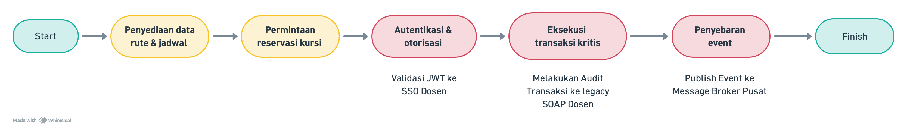
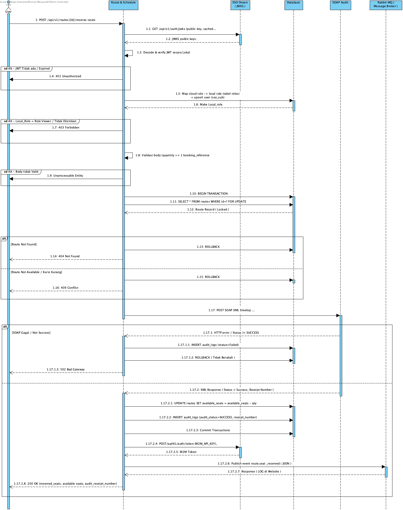

## Penjelasan Konteks Proses Bisnis

Pada Kelompok 12 ini ada 3 Mini-Service yang terdiri dari:

1. **Route & Schedule Service** : mengelola data rute, jadwal, harga, dan ketersediaan kursi.
2. **Ticket & Payment Service**  : menangani pemesanan tiket dan pembayaran.
3. **Delay Notification Service** : menangani notifikasi keterlambatan.


### Adapun alur bisnis yang dikerjakan oleh Route & Schedule Service:



1. **Penyediaan data rute & jadwal** : user mencari rute melalui `GET /api/v1/routes` dan melihat detail rute terpilih melalui `GET /api/v1/routes/{id}`, termasuk harga dan sisa kursi (`available_seats`).
2. **Permintaan reservasi kursi** : saat user melakukan booking, Ticket & Payment Service (machine-to-machine) memanggil `POST /api/v1/routes/{id}/reserve-seats` dengan JWT dari SSO dosen, jumlah kursi (`quantity`), dan `booking_reference`.
3. **Autentikasi & otorisasi** : service memvalidasi JWT ke SSO dosen, ladawdawlu dipetakan cloud role ke role lokal, dan menolak request jika role tidak sesuai dan berhak untuk melakukan service.
4. **Eksekusi transaksi kritis** : Memproses Baris Route yang sudah dipilih lalu memeriksa ketersediaan kursi dan transaksi diaudit ke Legacy SOAP dosen. `ReceiptNumber` disimpan, lalu field `available_seats` dikurangi. 
5. **Penyebaran event** : setelah transaksi selesai lalu service mempublikasikan event `route.seat_reserved` ke message broker pusat agar service lain (payment, notifikasi) mengetahui perubahan jumlah.
6. **Selesai** : response sukses dikembalikan ke Ticket & Payment Service, yang melanjutkan flow pembayaran dan e-ticket di luar tanggung jawab service ini.

##

**Posisi service ini dalam alur:**

Sebagai **Penjaga Jumlah Kursi**. Dimana tidak ada service selain service ini yang boleh mengubah `available_seats` secara langsung, semua perubahan kursi harus melalui endpoint reservasi service ini.

## Batasan Service

**Tanggung jawab service ini hanya sebatas:**

- CRUD data rute dan jadwal (`routes`).
- Validasi ketersediaan kursi dan eksekusi reservasi kursi (transaksi kritis).
- Audit transaksi kritis ke Legacy SOAP milik dosen dan penyimpanan `ReceiptNumber`.
- Publikasi event `route.seat_reserved` ke message broker pusat.

**Di luar tanggung jawab service ini:**

- Pembuatan booking, pembayaran, dan e-ticket (milik Ticket & Payment Service).
- Notifikasi delay ke penumpang (milik Delay Notification Service).

Pada service ini service lain hanya bisa berkomunikasi melalui REST API saja. service lain tidak ada akses langsung ke database service ini, dan begitu juga sebalik nya service ini tidak bisa membaca database service lain


## Pemilihan Transaksi Kritis Route & Schedule 

Transaksi yang dipilih: **Reservasi kursi pada sebuah rute.**

```
POST /api/v1/routes/{id}/reserve-seats
```

Dipanggil oleh Route & Schedule Service (machine-to-machine) saat user melakukan booking.

Isi Body Request:

```json
{
  "quantity": 2,
  "booking_reference": "BOOK-2026-0001"
}
```

Headers Service:

```
Authorization: Bearer <Token JWT dari SSO>
X-IAE-KEY: 102022400143
Content-Type: application/json
```

Efek dari transaksi ini adalah `available_seats` pada baris `routes` berkurang sebesar `quantity` lalu audit log tersimpan dengan `ReceiptNumber` dari SOAP dosen dan terakhir event `route.seat_reserved` dipublikasikan ke message broker dosen.
 


## Alasan Pemilihan Transaksi Kritis

Reservasi kursi memenuhi seluruh kriteria transaksi kritis pada rubrik penilaian ( service bisa masuk kekategori **stok/inventory** dan transaksi ini bersifat **state-changing**):

1. **Mengubah state stok.** `available_seats` adalah tempat penyimpanan kursi yang tersedia pada sistem. service ini mengubah nilai `available_seats` secara tetap atau permanen pada database, dan hanya service ini yang boleh mengubah nilai `available_seats`.
2. **Transaksi ini berdampak langsung pada finansial.** Setiap kursi yang ter-reservasi oleh service ini berhubungan langsung dengan pembayaran di Ticket & Payment Service. Kesalahan pada transaksi stok bisa menyebabkan kerugian finansial atau penumpang tanpa kursi.
3. **Rawan terjadi pemesanan double ( Race Condition ).** jika terjadi 2 booking secara bersamaan pada kursi terakhir dapat menyebabkan *overselling*. Karena itu transaksi ini menggunakan database transaction + row lock ( Mengunci Transaksi) agar tidak terjadi pemesanan double.
4. **Riwayat Transaksi harus ter-record secara ketat** Karena transaksi ini berdampak langsung ke finansial, setiap eksekusi harus di audit terlebih dahulu ke sistem Legacy SOAP **sebelum commit**. dan jika gagal, transaksi di batalkan ( melakukan rollback).
5. **Transaksi harus diketahui service lain.** Perubahan stok kursi harus diketahui oleh service lain (payment melanjutkan flow, notifikasi, analitik)

### Operasi lain yang tidak dipilih: 

`GET /routes` Operasi ini bersifat read-only, tidak mengubah state stok kursi.

`POST /routes` Operasi ini bersifat data master dan banyak dilakukan oleh admin bukan user

 **Tidak memenuhi kriteria ini.**


## Sequence Diagram Internal

